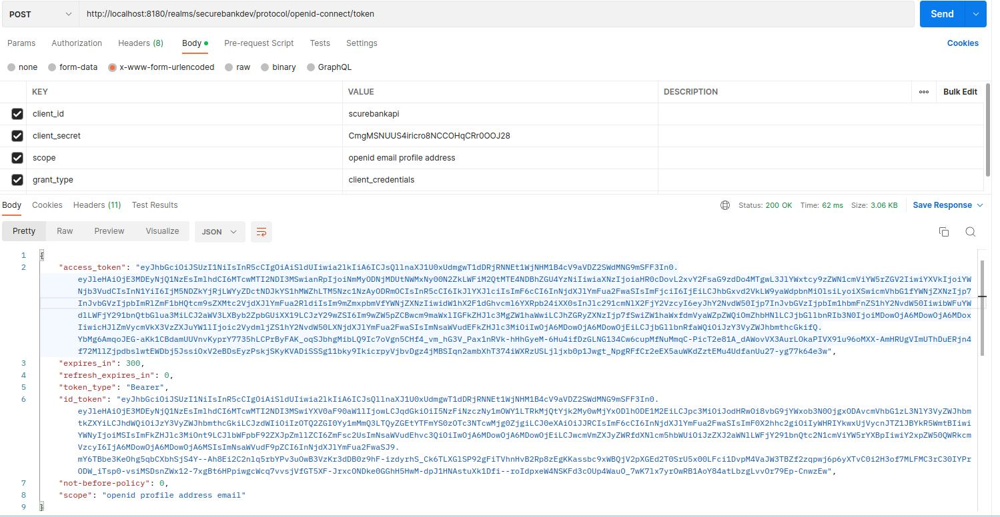
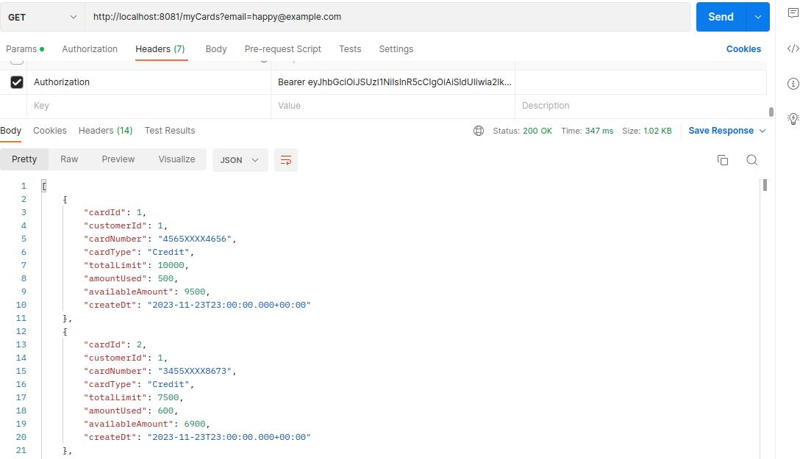
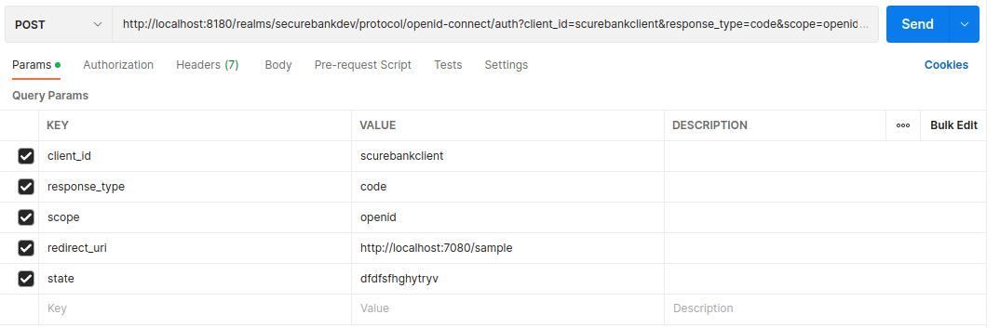

# SecureBankApp Application Documentation
This course provides a comprehensive exploration of Spring Security Architecture. Gain insights into crucial packages, interfaces, and classes that play pivotal roles in handling authentication and authorization requests within web applications. The course delves into essential security concepts, including CORs, CSRF, JWT, OAUTH2, password management, method-level security, as well as the effective management of users, roles, and authorities within web applications. By the end of this course, you'll master the intricacies of Spring Security and be well-equipped to implement robust security measures in your projects.

## 01 - Getting Started: 
***Project name: 1-spring-security-basic***
### 1. Add Spring Security Dependency: Include the Spring Security dependency in your project's configuration.
    ```
        <dependency>
          <groupId>org.springframework.boot</groupId>
          <artifactId>spring-boot-starter-security</artifactId>
        </dependency>
    ```
### 2. Configure Basic User Credentials:
Utilize [Security Properties](https://docs.spring.io/spring-boot/docs/current/reference/html/application-properties.html#appendix.application-properties.security) to manage basic username and password authentication.
Example application.properties:
```shell
spring.security.user.name=user
spring.security.user.password=secret
```
Customize the provided credentials to suit your application's security requirements.

## 02 - Changing the Default Security Configurations:
***Project name: 2-spring-security-configurations***
We've taken the initiative to enhance the default security configuration by customizing the defaultSecurityFilterChain method inside ProjectSecurityConfig class:
### 1. Securing Specific Services:
   The ***.antMatchers("/secured-service1", "/secured-service2").authenticated()*** configuration ensures that access to "/secured-service1" and "/secured-service2" requires authentication. Users must be authenticated to access these services.
### 2. Allowing Unrestricted Access:
   Conversely, ***.antMatchers("/public-service1", "/public-service2").permitAll()*** allows unrestricted access to "/public-service1" and "/public-service2". These services are accessible without authentication.
### 3. Denying Access to Restricted Endpoints:
   The new configuration ***.antMatchers("/restricted-service1", "/restricted-service2").denyAll()*** explicitly denies access to "/restricted-service1" and "/restricted-service2". Any attempt to access these endpoints will be rejected.
### 4. Default Authentication for Other Endpoints:
   The configuration ***.anyRequest().authenticated()*** ensures that any other request not covered by specific matchers requires authentication.
### 5. Permitting or Denying Access to All Other Endpoints:
   ***.anyRequest().permitAll()*** permits access to all other endpoints, providing an open access policy. Alternatively, ***.anyRequest().denyAll()*** denies access to all other endpoints, creating a restrictive access policy.
### 6. HTTP Basic Authentication:
   Finally, ***.httpBasic()*** configures the application to use HTTP Basic Authentication.

## 03 - Defining & Managing Users
Learn how to define and manage users within the SecureBankApp application.
***Project name: 3-spring-security-managing-users***
We've implemented two distinct approaches in the userDetailsService method:
### 1. Approach 1: Using ***withDefaultPasswordEncoder()***
In this approach, we leverage the withDefaultPasswordEncoder() method while creating user details. This method provides a convenient way to encode passwords with a default password encoder. However, note that this approach may not be suitable for production usage due to potential security vulnerabilities.
### 2. Approach 2: Using ***NoOpPasswordEncoder Bean***
   In Approach 2, we use the NoOpPasswordEncoder bean while creating user details. It's essential to note that NoOpPasswordEncoder is not recommended for production usage due to its inherent security risks.
### 3. Adding LDAP Dependencies:
   To integrate LDAP (Lightweight Directory Access Protocol) into your project, add the following dependencies to your project's build configuration:
     ```xml
        <dependency>
            <groupId>org.springframework.ldap</groupId>
            <artifactId>spring-ldap-core</artifactId>
            <version>3.2.0</version>
        </dependency>
        <dependency>
            <groupId>org.springframework.security</groupId>
            <artifactId>spring-security-ldap</artifactId>
            <version>6.2.0</version>
        </dependency>
     ```
### 4. Create Mysql DB On [Free MySQL Hosting](https://www.freemysqlhosting.net/) then using script.sql file
### 5. Perform ***JdbcUserDetailsManager*** inside the ***userDetailsService*** method, This involves configuring the JdbcUserDetailsManager bean and using it to load user details from a MySQL database.
### 6. Building a REST API to allow the registration of new User so create a new LoginController class

## 04 - Password Management with PasswordEncoders
***Project name: 4-password-management-with-passwordEncoders***
### 1. Using ***BCryptPasswordEncoder*** instead of ***NoOpPasswordEncoder*** to register a new user with ***Bcrypt password encoder***
   * Postman request: 
   ```json
    {
      "email": "scott@sample.com",
      "pwd" : "12345",
      "role" : "user"
    }
   ```
## 05 - Understanding Authentication Provider and Implementing It
***Project name: 5-spring-security-authentication-provider***
* The primary role of an AuthenticationProvider is to perform the authentication of a user. It takes the credentials (such as username and password) provided by the user during a login attempt and determines whether they are valid.
### 1. Create SecureBankUsernamePwdAuthenticationProvider class to authenticate username and password

## 06 - Understanding CORs & CSRF
***Project name: 5-spring-security-authentication-provider***
* Cross-Origin Resource Sharing (CORS) and Cross-Site Request Forgery (CSRF):
  CORS protects our app from sending data to unauthorized domains, while CSRF protects our web app from receiving unauthorized requests from external sources.

### 1. Update DB schema using script.sql file
### 2. We've implemented the FrontEnd work, by building an Angular App called ***bank-app-ui***
### 3. The issue arises when attempting to retrieve data from the backend:
   ```xml
      Access to XMLHttpRequest at 'http://localhost:8081/notices' from origin 'http://localhost:4200' has been blocked by CORS policy: Response to preflight request doesn't pass access control check: No 'Access-Control-Allow-Origin' header is present on the requested resource.
   ```
   **The error message we're encountering is a CORS (Cross-Origin Resource Sharing) issue.**
### 4. Fixing CORs issue using Spring Security:
   * **NB:**  Instead of mentioning @CrossOrigin annotation on all the controllers inside our web app, we can define CORS related configurations globally using Spring Security like shown below
     ```java
         http.cors(corsCustomizer -> corsCustomizer.configurationSource(new CorsConfigurationSource() {
         @Override
         public CorsConfiguration getCorsConfiguration(HttpServletRequest request) {
         CorsConfiguration config = new CorsConfiguration();
         config.setAllowedOrigins(Collections.singletonList("http://localhost:4200"));
         config.setAllowedMethods(Collections.singletonList("*"));
         config.setAllowCredentials(true);
         config.setAllowedHeaders(Collections.singletonList("*"));
         config.setMaxAge(3600L) //in seconds;
         return config;
         }
         })
     ```
   *  Sets the Cache-Control header in the HTTP response in NoticeController class <br/>
   ```java 
     .cacheControl(CacheControl.maxAge(60, TimeUnit.SECONDS))
   ```
   In this case, it's setting the maximum age of the response to 60 seconds. This means that the client (e.g., a web browser) is allowed to cache the response for up to 60 seconds before making a new request to the server.  
### 5. Solution to handle CSRF attacks:
   1. By default, when we try to send a request from contact form to our backend CSRF block that request and return a 401 error
   2. We have been excluding certain requests from CSRF protection. This is useful when you have certain endpoints that should be exempt from CSRF checks, typically because they are considered safe and don't involve actions that could lead to security vulnerabilities.
       ```java
          // Ignoring CSRF protection for public APIs using
            csrf().ignoringRequestMatchers("/contact", "/register")
       ```
   3. To defeat a CSRF attack, the best way to achieve this is through a **CSRF token (CSRF Protection Configuration)**
    The following code configures CSRF (Cross-Site Request Forgery) protection in a Spring Security setup:
***<br/>Step 1: In ProjectSecurityConfig***:
       ```java
       .csrf((csrf) ->
           csrf.csrfTokenRequestHandler(requestHandler)
               .ignoringRequestMatchers("/contact", "/register")
               .csrfTokenRepository(CookieCsrfTokenRepository.withHttpOnlyFalse())
       )
       ``` 
      ###### Explanation:
      - **`.csrf((csrf) -> ...)`:** Indicates the starting point for configuring CSRF.

      - **`.csrfTokenRequestHandler(requestHandler)`:** Specifies the custom request handler for obtaining the CSRF token. The `requestHandler` variable likely refers to an implementation of `CsrfTokenRequestHandler`.

      - **`.ignoringRequestMatchers("/contact", "/register")`:** Configures CSRF protection to be ignored for requests matching the specified request matcher patterns ("/contact" and "/register"). This means that CSRF tokens won't be required for requests to these specific endpoints.

      - **`.csrfTokenRepository(CookieCsrfTokenRepository.withHttpOnlyFalse())`:** Configures the repository where CSRF tokens are stored. In this case, it uses a `CookieCsrfTokenRepository` with the option to make the CSRF cookie accessible to JavaScript (using `withHttpOnlyFalse()`). This is often needed if you want to read the CSRF token from JavaScript for certain client-side interactions.
      This configuration is suitable for scenarios where you want to customize how CSRF protection is handled, specify exceptions for certain endpoints, and configure the repository for CSRF tokens.
      
***<br/>Step 2: Create CsrfCookieFilter class***: This filter seems to be responsible for ensuring that the CSRF token is included in the response headers. Including the CSRF token in the headers allows the client-side application, usually a web browser, to retrieve the token and include it in subsequent requests, providing protection against CSRF attacks.
***<br/>Step 3:*** In frontend on **LoginComponent** we must `import { getCookie } from "typescript-cookie"` after `npm i tslib` then adding the typescript code
   ```javascript
            let xsrf = getCookie('XSRF-TOKEN')!;
            window.sessionStorage.setItem("XSRF-TOKEN",xsrf);
            window.sessionStorage.setItem("userdetails",JSON.stringify(this.model));
       
```
**In XhrInterceptor class we must add**
```javascript
            let xsrf = sessionStorage.getItem('XSRF-TOKEN');
            if (xsrf) {
              httpHeaders = httpHeaders.append('X-XSRF-TOKEN', xsrf);  
            }
```
 This code is commonly used in web applications that implement CSRF protection. The XSRF token is typically stored in a cookie, and this code retrieves it from the session storage to include it in subsequent HTTP requests. The 'X-XSRF-TOKEN' header is often used to transmit the CSRF token back to the server for verification.

## 07 - Understanding & Implementing Authorization
***Project name: 7-spring-security-authorization***
### 1. Add table in DB by using sql script and Authority class
### 2. In SecureBankUsernamePwdAuthenticationProvider class add this method to return a list of grantedAuthorities
```java
 private List<GrantedAuthority> getGrantedAuthorities(Set<Authority> authorities) {
        List<GrantedAuthority> grantedAuthorities = new ArrayList<>();
        for (Authority authority : authorities) {
            grantedAuthorities.add(new SimpleGrantedAuthority(authority.getName()));
        }
        return grantedAuthorities;
    }
```
### 3. Configuring Authorities in defaultSecurityFilterChain method:
- **`hasAuthority("SOME_AUTHORITY")`:** Requires the user to have a specific authority ("SOME_AUTHORITY") to access the specified endpoint.
- **`hasAnyAuthority("AUTHORITY1", "AUTHORITY2")`:** Requires the user to have at least one of the specified authorities ("AUTHORITY1" or "AUTHORITY2") to access the specified endpoint.
```java
        // Access restricted based on user authority.
        .requestMatchers("/myAccount").hasAuthority("VIEWACCOUNT")
        .requestMatchers("/myBalance").hasAnyAuthority("VIEWACCOUNT", "VIEWBALANCE")
        .requestMatchers("/myLoans").hasAuthority("VIEWLOANS")
        .requestMatchers("/myCards").hasAuthority("VIEWCARDS")
        .requestMatchers("/user").authenticated()
```
### 4. Configuring Roles Authorization in defaultSecurityFilterChain method:
```roomsql
 DELETE FROM `authorities`;
 INSERT INTO `authorities` (`customer_id`, `name`)
  VALUES (1, 'ROLE_USER');
 INSERT INTO `authorities` (`customer_id`, `name`)
  VALUES (1, 'ROLE_ADMIN');
```
- **`access("hasRole('ROLE_NAME') and hasIpAddress('192.168.0.1')")`:** Uses a custom expression to define access control. In this example, the user must have a specific role ("ROLE_NAME") and access the endpoint from a specific IP address ('192.168.0.1').
- **`hasRole("ROLE_NAME")`:** Requires the user to have a specific role ("ROLE_NAME") to access the specified endpoint.
- **`hasAnyRole("ROLE1", "ROLE2")`:** Requires the user to have at least one of the specified roles ("ROLE1" or "ROLE2") to access the specified endpoint.
```java
    .requestMatchers("/myAccount").hasRole("USER")
    .requestMatchers("/myBalance").hasAnyRole("USER", "ADMIN")
    .requestMatchers("/myLoans").hasRole("USER")
    .requestMatchers("/myCards").hasRole("USER")
```
## 08 - Writing and Exploring a Custom Filters in Spring Security
***Project name: 8-spring-security-custom-filters***
### 1. Configuring debug logging for the FilterChainProxy in Spring Security:
This class is a responsible for managing the filter chain in Spring Security.
we can check the registered filters inside Spring Security with the below configurations:
**Not Recommended for production**
 ```java
  @EnableWebSecurity(debug = true)
  logging.level.org.springframework.security.web.FilterChainProxy=DEBUG
 ```
### 2. Implementing Custom Filters to perform checks before and after authentication:
- * Add Filter Before BasicAuthenticationFilter using addFilterBefore(filter, class):
    1. Create the RequestValidationBeforeFilter class in filter package to check email has a "test" word
    2. Add ***addFilterBefore(filter, class)*** method in our defaultSecurityFilterChain method
- * Add Filter After BasicAuthenticationFilter using addFilterAfter(filter, class):
    1. Create the AuthoritiesLoggingAfterFilter class in filter package to write a logger about successful authentication and authorities details of the logged-in users
    2. Add ***addFilterAfter(filter, class)*** method in our defaultSecurityFilterChain method
- * Add Filter At BasicAuthenticationFilter using addFilterAt(filter, class):
    1. Create the AuthoritiesLoggingAtFilter class in filter package 
    2. Add ***addFilterAt(filter, class)*** method in our defaultSecurityFilterChain method
## 09 - Token-Based Authentication Using JSON Web Token (JWT)
***Project name: 9-spring-security-jwt-token***
### 1. Making project configuration to use JWT Tokens:
- 1. These dependencies are used when working with JWTs in our application. we use them for creating, parsing, and validating JWTs as part of user authentication, authorization,
```xml
    <dependency>
        <groupId>io.jsonwebtoken</groupId>
        <artifactId>jjwt-api</artifactId>
        <version>0.11.5</version>
    </dependency>
    <dependency>
        <groupId>io.jsonwebtoken</groupId>
        <artifactId>jjwt-impl</artifactId>
        <version>0.11.5</version>
        <scope>runtime</scope>
    </dependency>
    <dependency>
        <groupId>io.jsonwebtoken</groupId>
        <artifactId>jjwt-jackson</artifactId> 
        <version>0.11.5</version>
        <scope>runtime</scope>
    </dependency>
```
- 2. In `defaultSecurityFilterChain()` method we must change:
 ```java
http.securityContext((context) -> context
                        .requireExplicitSave(false))
                .sessionManagement(session -> session.sessionCreationPolicy(SessionCreationPolicy.ALWAYS))
```
**By**
```java
 http.sessionManagement(session -> session.sessionCreationPolicy(SessionCreationPolicy.STATELESS))
```
| Characteristic         | Stateless                                              | Stateful                                                |
|------------------------|--------------------------------------------------------|---------------------------------------------------------|
| **Server-Side State**   | No server-side state.                                  | Server stores state information about the client.        |
| **Each Request**        | Each request is treated independently.                | Requests are part of a larger session, and state is maintained between them. |
| **Server Load**         | Reduced server load as there's no need to manage state. | Can result in higher server load due to session management and state storage. |
| **Scalability**         | Highly scalable; easy to add or remove servers.        | May be less scalable due to the need to synchronize state across servers. |
| **State Transfer**      | State information is transferred with each request.    | State information is often maintained on the server and associated with a session ID. |
| **Complexity**          | Simplicity in design and implementation.               | Can be more complex due to the management of session state. |
| **Use Cases**           | Commonly used in RESTful APIs, microservices.          | Often used in traditional web applications, where continuous state is crucial. |
- 3. Tell the server to inform the browser that it's okay for JavaScript running on a web page to access the "Authorization" header in the response when making cross-origin requests. This is important when dealing with authentication tokens
 ```java
   config.setExposedHeaders(Arrays.asList("Authorization"));
 ```
### 2. Configuring filter to generate the JWT Tokens:
- 1. Create JWTTokenGeneratorFilter class in filter package
- 2. ``.addFilterAfter(new JWTTokenGeneratorFilter(), BasicAuthenticationFilter.class)`` to `defaultSecurityFilterChain` method
### 3. Configuring filter to validate the JWT Tokens:
- 1. Create JWTTokenValidatorFilter class in filter package
- 2. ``.addFilterBefore(new JWTTokenValidatorFilter(), BasicAuthenticationFilter.class)`` to `defaultSecurityFilterChain` method
### 4. Making changes on the client side for JWT token based authentication 
- 1. On the `LoginComponent` we need to read a header named `authentication` so in validateUser() method add the code below:
```javascript
 window.sessionStorage.setItem("Authorization",responseData.headers.get('Authorization')!);
```
  * It's common practice to store authentication-related JWT tokens in the session storage of web applications. This allows for later use, especially when making authenticated requests.
- 2. In XhrInterceptor class: 
  * Setting the 'Authorization' header for HTTP requests, likely in the context of user authentication
  ```javascript
    if(this.user && this.user.password && this.user.email){
      httpHeaders = httpHeaders.append('Authorization', 'Basic ' + window.btoa(this.user.email + ':' + this.user.password));
    }else {
      let authorization = sessionStorage.getItem('Authorization');
      if(authorization){
        httpHeaders = httpHeaders.append('Authorization', authorization); 
      }
    }
  ```
- 3. When we have been Decoding the JWTToken:
  <div>
    
  </div>

## 10 - Method Level Security
***Project name: 10-spring-security-method-level-security***
### 1. Method level security :
Method level security allows to apply the authorization rules at any layer of an application like in service layer or repository
   layer etc. Method level security can be enabled using the annotation `@EnableMethodSecurity` on the  configuration class.
   Method level security offers below 3 different styles for configuring the authorization rules on top of the
   methods,
   * The prePostEnabled property enables Spring Security @PreAuthorize & @PostAuthorize annotations
   * The securedEnabled property enables @Secured annotation
   * The jsr250Enabled property enables @RoleAllowed annotation
   * Enable method level security `@Configuration
     @EnableMethodSecurity (prePostEnabled = true, securedEnabled = true, jsr250Enabled = true)
      public class ProjectSecurity Config {}`
   * The `@Secured and @RoleAllowed `annotations are less powerful than the `@PreAuthorize and @PostAuthorize` annotations because they do not allow you to specify more complex authorization rules.
   * Using invocation authorization we can decide if a user is authorized to involve a method before the method executes (preauthorization) or after the method execution is completed
     (postauthorization). For filtering the parameters before calling the method we can use Prefiltering
### 2. Using @PreAuthorize
```java
.requestMatchers("/myLoans").authenticated()
// Add this annotation on main class
@Configuration
@EnableMethodSecurity (prePostEnabled = true, securedEnabled = true, jsr250Enabled = true)
// In LoansRepository interface on the method add this annotation
   @PreAuthorize("hasRole('USER')")
```
### 3. Using @PostAuthorize
```java
// In LoansController class on the method add this annotation
@PostAuthorize("hasRole('USER')")
```
### 4. Filtering authorization 
1. - *  `@PreFilter`: If we have a scenario where we don't want to control the invocation of the method but we want to make sure that the parameters sent and received to/from the method need to follow authorization rules or filtering criteria, then we can consider filtering.
    • For filtering the parameters before calling the method we can use PreFilter annotation. But the filterObject should be of type Collection interface.
   ``` @RestController
    public class ContactController {
    @PreFilter("filterObject.contactName != "Test"")
    public List<Contact> saveContactInquiryDetails(@RequestBody List<Contact> contacts) {
    // business logic
    return contacts;
    }
    }
   ```

2. - * `@PostFilter`: For filtering the parameters after executing the method we can use PostFilter annotation. But please note that the filterObject should be of type Collection interface.
```@RestController
    public class ContactController {
    @PostFilter("filterObject.contactName != "Test")
    public List<Contact> saveContactInquiry Details(@Request Body List<Contact> contacts) {
    // business logic
    return contacts;
    }
    }
   ```
• We can use the @PostFilter on the Spring Data repository methods as well to filter any unwanted data coming from the database.

## 11 - OAuth2 & OpenID Connect
- * OAuth 2.0 (OAuth2) is an authorization protocol that allows third-party applications to access a user's data without sharing credentials. It uses temporary tokens to ensure secure access:
- **Purpose:** Authorization protocol for secure access to resources in web applications and APIs.
- **Components:** User, Client Application, Authorization Server, Resource Server.
- **Tokens:** Uses temporary access tokens instead of user credentials.
- **Grant Types:** Authorization Code, Implicit, Resource Owner Password Credentials, Client Credentials.
### 1. Demo of Authorization code grant type flow in OAUTH2

#### OAuth.com Playground
The **OAuth 2.0 Playground** is a tool designed to assist developers in understanding and testing OAuth authorization flows. It provides a simulated OAuth 2.0 authorization server, allowing users to walk through various OAuth flows, including authorization code, implicit grant, and resource owner password grant.
#### Using the [OAuth.com Playground](https://www.oauth.com/playground/)
##### Usage:
1. **Create Registration:**
    - Click **"Create Client"** to make a client.

2. **Select OAuth Authorization Code Flow:**
    - Choose from authorization code, implicit grant, or resource owner password grant.

3. **Configure OAuth Request:**
    - Fill in details like Client ID, Client secret, Redirect URI, Scope, and State.

4. **Authorize and Review:**
    - Click **"Authorize"** to redirect to the simulated server.
    - Review the server's response, including the access token.

### 2. Introduction to OpenID Connect (OIDC):
- **Purpose:** Authentication layer built on OAuth2 for user authentication and obtaining user information.
- **Components:** Adds Identity layer to OAuth2 with Client, Authorization Server, Resource Server, and User.
- **ID Token:** A JSON Web Token (JWT) containing claims about the authenticated user.
- **Flow:** Client registration, Authorization request, User authentication, Authorization grant, Token request, Token validation, User information request (optional).

### 3. Combined Use:
- **OAuth2 + OIDC:** Often used together for comprehensive authentication and authorization in modern applications.
- **Result:** Secure and standardized access to resources with user authentication and profile information.
-  * In practical terms, OAuth2 is primarily concerned with authorization, allowing third-party applications to access resources on behalf of users,
    while OpenID Connect adds a layer for authentication, enabling secure user logins and providing user profile information in a standardized way.
    The combination of OAuth2 and OpenID Connect is commonly used for building secure, modern, and user-friendly authentication and authorization systems.

## 12 - Implementing OAuth2 Using Spring Security
### 1. Steps to Register Your Client with GitHub for OAuth2
Follow these steps to register your client details with GitHub for OAuth2:
1. **Go to GitHub Settings:**
    - Click on your profile photo and then navigate to Settings.
2. **Access Developer Settings:**
    - In the bottom of the left sidebar, click on Developer Settings.
3. **Navigate to OAuth Apps:**
    - In the left sidebar, click on "OAuth Apps".
4. **Register a New Application:**
    - Click on "Register a new application".
5. **Fill in the Form:**
    - Enter the following details:
        - **Application Name:** The name of your app.
        - **Homepage URL:** The full URL to your app's website.
        - **Application Description (Optional):** A description of your app that users will see.
        - **Authorization Callback URL:** The callback URL of your app.
6. **Enable Device Flow (if required):**
7. **Register Application:**
    - Click "Register application" to create your application.
8. **Get Client ID and Client Secret:**
    - After registration, you will be provided with a Client ID and a Client Secret.
- [GitHub Docs - Authorizing OAuth apps](https://docs.github.com/en/apps/oauth-apps/building-oauth-apps/authorizing-oauth-apps)
- [GitHub Docs - Creating an OAuth app](https://docs.github.com/en/apps/oauth-apps/building-oauth-apps/creating-an-oauth-app)

### 2.  Implementing OAuth2 Using Spring Security
***Project name: 12-spring-security-oauth2-gitHub***

## 13 - Implementing OAuth2 Style Login Inside SecureBank App Using KeyCloak
***Project name: 13-spring-security-oauth2-using-KeyCloak
- **Keycloak**, is an open-source identity and access management tool. It offers Single Sign-On, User Federation, Identity Brokering, Role-Based Access Control, and supports OAuth 2.0 and OpenID Connect protocols for secure autorization and authentication. Widely used for securing applications, APIs, and microservices, Keycloak's admin console enables easy configuration.
##### Keycloak Configuration Steps:
### 1. Start Keycloak Development Server
```bash
bin/kc.sh start-dev --http-port 8180
```
### 2. Setup a Realm for SecureBank App
- Launch Keycloak Server
- Create a Realm: **Securebankdev**
### 3. Create Client Credentials for API Secured Invocations
- Access Keycloak Admin Console
- Navigate to Clients
- Create a new client ID: **securebankapi**
- Enable Client Authentication
- Allow Service Accounts Roles
### 4. Setup of SecureBank Resource Server
   1. Add dependency
    ```xml
    <dependency>
        <groupId>org.springframework.boot</groupId>
        <artifactId>spring-boot-starter-oauth2-resource-server</artifactId>
    </dependency>
    ```
   2. In the defaultSecurityFilterChain method inside ProjectSecurityConfig class must kepp just :
     ```java
    .addFilterAfter(new CsrfCookieFilter(), BasicAuthenticationFilter.class)
    ```
   3. In the filter package keep only `CsrfCookieFilter class`
   4. In the config package keep only `ProjectSecurityConfig class`
   5. Delete `passwordEncoder() method` method in `ProjectSecurityConfig class`, delete `SecurityConstants interface` as well  
   6. Create new class `KeycloakRoleConverter` in config package
   7. In the `defaultSecurityFilterChain method` add:
     ```java
    JwtAuthenticationConverter jwtAuthenticationConverter = new JwtAuthenticationConverter();
    jwtAuthenticationConverter.setJwtGrantedAuthoritiesConverter(new KeycloakRoleConverter());
    ```
    * This code configures a JwtAuthenticationConverter with a custom converter (KeycloakRoleConverter) to handle the extraction and conversion of granted authorities from a JWT.
    8. Instead of `.formLogin(Customizer.withDefaults()).httpBasic(Customizer.withDefaults());` replace it by :
      ```java 
     .oauth2ResourceServer(oauth2ResourceServerCustomizer ->
                        oauth2ResourceServerCustomizer.jwt(jwtCustomizer -> jwtCustomizer.jwtAuthenticationConverter(jwtAuthenticationConverter)));
      ```
   9. In the `AccountController, BalanceController, CardsController and LoansController` classes update the parameters and bodies of the methods
   10. In the application.properties add this line `spring.security.oauth2.resourceserver.jwt.jwk-set-uri = http://localhost:8180/realms/securebankdev/protocol/openid-connect/certs`
   11. Remove `PasswordEncoder` and `registerUser` method from LoginController class

### 5. Getting Access token from KeyCloak using **client credentials grant type** in `scurebankapi` client id
   1. From **Access the Discovery Endpoint:**: http://localhost:8180/realms/securebankdev/.well-known/openid-configuration/ get **Retrieve the "token_endpoint":** http://localhost:8180/realms/securebankdev/protocol/openid-connect/token
   2. Using postman to insert keys and values, as shown in the image below:
      <div>
         
      </div>
   3. Keycloak Role Configuration for `securebankapi`
      Follow these steps to set up ADMIN and USER roles for the `securebankapi` client in the `securebankdev` realm:
      1. **Create Roles:**
         - In the Keycloak administration console, navigate to the `securebankdev` realm.
         - Go to "Roles" and create two roles: ADMIN and USER.
      2. **Assign Roles to `securebankapi` Client:**
          - Still in the `securebankdev` realm, navigate to "Clients" and select the `securebankapi` client.
          - Go to "Service Account Roles" and assign the roles you created (ADMIN and USER) to the service account.
          ***Viewing Roles in the Access Token:***
          - After configuring roles in Keycloak and assigning them to the `securebankapi` client, you can observe the roles in the access token. Here's the result in JSON format:
            ```json
            "realm_access": {
                "roles": [
                    "default-roles-securebankdev",
                    "offline_access",
                    "uma_authorization",
                    "ADMIN",
                    "USER"
                ]
            }
            ```
### 6. Passing Access token to Resource server for response through Postman
       <div>
           
       </div>
### 7. Creating Client and User Details in Keycloak for Auth Code Grant Flow
Follow these steps to set up a client for the Auth Code Grant Flow in Keycloak:
1. **Access Keycloak Admin Console:**
    - Log in to the Keycloak Admin Console.
2. **Navigate to Clients:**
    - In the console, go to the "Clients" section.
3. **Create a New Client ID: `securebankclient`:**
    - Click on "Create" to add a new client.
    - Set the Client ID to **securebankclient**.
4. **Enable Client Authentication:**
    - Within the client settings, ensure that Client Authentication is enabled.
5. **Allow Standard Flow:**
    - Under the client settings, enable or allow the Standard Flow.
6. **Set Valid Redirect URIs:**
    - Within the client settings, locate the field for Redirect URIs.
    - Specify the valid Redirect URIs for your client application.  
7.  **Navigate to Users:**
    - In the console, go to the "Users" section.
    - Click on "Add User" to create a new user profile.
    -  Under the "Credentials" tab, set the desired password for the user.
### 8. Testing Authorization code grant type using Postman App
1. FROM **Access the Discovery Endpoint:**
    - Open your web browser and navigate to the OpenID Connect discovery endpoint. In this example, the URL is:
        - [http://localhost:8180/realms/securebankdev/.well-known/openid-configuration/](http://localhost:8180/realms/securebankdev/.well-known/openid-configuration/)
2. **Retrieve the "authorization_endpoint":**
    - Look for the "authorization_endpoint" field in the JSON response.
    - It should be something like: authorization_endpoint": "http://localhost:8180/realms/securebankdev/protocol/openid-connect/auth
    - Add params using postman as shown below
3. **Use Postman to Add Parameters**:
   - Enter the "authorization_endpoint" URL in the request URL field.
   - Add the necessary parameters for authentication.
     <div>
           
     </div>
   - Copy the modified URL with parameters from Postman.
   - Paste the URL into your web browser and try to login using the user credentials created in Keycloak. (in my case happ@example.com/12345)
   ....
### 9. Demo of Authorization code grant type with PKCE:

The OAuth 2.0 authorization code grant type with Proof Key for Code Exchange (PKCE) is a secure method for authorizing third-party applications to access user resources on an HTTP service. PKCE mitigates the risk of authorization code interception by using a cryptographically secure verifier that is only known to the client and server.
1. Register a Client
   1. Navigate to the [OAuth 2.0 Playground](https://www.oauth.com/playground/):
   2. Click on the "Register" button.

2. Generate PKCE Code Verifier and Code Challenge
   1. Generate a cryptographically random code verifier using a strong random number generator.
   2. Calculate the code challenge using the SHA-256 hash function and Base64url encoding.
3. Initiate Authorization Code Flow
   1. Construct the authorization request URL using the following parameters:
    * `response_type`: `code`
    * `client_id`: Your client ID
    * `redirect_uri`: The redirect URI for your application
    * `code_challenge`: The calculated code challenge
    * `code_challenge_method`: `S256` (indicating the SHA-256 hash method)
    * `scope`: The scope of resources you want to access
   2. Redirect the user to the authorization endpoint provided by the OAuth authorization server.

4. User Authorization
   1. The user will be prompted to authorize your application to access their resources.
   2. Upon successful authorization, the user will be redirected back to your application's redirect URI with an authorization code.

5. Exchange Authorization Code for Access Token
   1. Construct the token request URL using the following parameters:
       * `grant_type`: `authorization_code`
       * `client_id`: Your client ID
       * `client_secret`: Your client secret
       * `redirect_uri`: The redirect URI for your application
       * `code`: The authorization code received in Step 4
       * `code_verifier`: The original code verifier generated in Step 2
   2. Send a POST request to the token endpoint provided by the OAuth authorization server.
   3. The server will validate the authorization code and exchange it for an access token.
   4. The access token can be used to make authorized requests to the protected resource server.
### 10. Creating public facing client details inside KeyCloak server
1. Navigate to the Keycloak Admin Console.
2. Log in with your admin credentials.
3. In the left-hand menu, click on "Clients."
4. Create a new client:
    - Click on "Create."
    - Choose the client type as `openid connect`.
    - Set the client ID to `bankpublicclient`.
5. Configure client settings:
    - Turn off client authentication.
    - Enable the Standard flow in the Authentication Flow section.
    - Specify the following redirect URIs:
        - Valid Redirect URIs: http://localhost:4200/dashboard
        - Valid Post Logout Redirect URIs: http://localhost:4200/home
6. Save the settings.
7. Configure advanced settings:
    - In the "Advanced" section, navigate to "Advanced Settings."
    - Set the "Proof Key for Code Exchange Code Challenge Method" to `S256`.
8. Save the advanced settings.
### 11. Implementing PKCE Authorization code grant type inside Angular UI App 
1. [Angular Keycloak library](https://www.npmjs.com/package/keycloak-angular):
```javascript
npm install keycloak-angular@12.1.0 keycloak-js@18.0.1
```
2. Allow two option in angular.json:
    ```json
     "allowedCommonJsDependencies": [
                  "base64-js",
                  "js-sha256"
               ],
    ```
3. In the `app.module.ts` :
    ```typescript
    import { APP_INITIALIZER,NgModule } from '@angular/core';
    import { KeycloakAngularModule, KeycloakService } from 'keycloak-angular';
    
    function initializeKeycloak(keycloak: KeycloakService) {
      return () =>
        keycloak.init({
          config: {
            url: 'http://localhost:8180/',
            realm: 'eazybankdev',
            clientId: 'eazypublicclient',
          },
          initOptions: {
            pkceMethod: 'S256',
            redirectUri: 'http://localhost:4200/dashboard',
          },loadUserProfileAtStartUp: false
        });
    }
    imports:[
      KeycloakAngularModule,
    ]
   
    provide: APP_INITIALIZER ,
      useFactory: initializeKeycloak,
      useClass: XhrInterceptor,
      multi: true,
      deps: [KeycloakService],
    ```
4. In the `HeaderComponent` update and add source code 
5. add `AuthKeyClockGuard` class in `auth.route.ts` 
6. In `app-routing.module.ts` add the roles for each component `[AuthKeyClockGuard],data: { roles: ['USER','ADMIN']`
7. Modify the components for Account, Balance, Loans, and Cards to incorporate email as a parameter.
8. Testing PKCE flow inside UI App
9. Important features of KeyCloak:
   - * Change [login theme](https://www.keycloak.org/docs/latest/server_development/index.html#_themes)
   - * [Administration REST API](https://www.keycloak.org/docs-api/23.0.1/rest-api/index.html)
   - * Client scopes > email, address, we can Create client scope
10. Social Login integration with the help of KeyCloak Server

